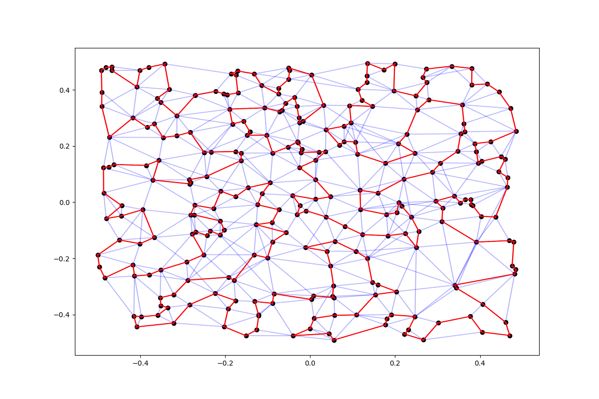

PyPOPMusic
==========
What is it?
-----
PyPOPMusic is a simple Python wrapper around the POPMusic TSP solver implemented in [LKH 2.0.9](http://webhotel4.ruc.dk/~keld/research/LKH/).

<p align="center">
	
</p>

PyPOPMusic allows you to compute candidate lists for the Traveling Salesman Problem. It uses the fast LKH solver implemented in C and provides a convenient Python layer around it.

How do I install it?
------
PyPOPMusic is tested under Python 3.8. It contains a modified version of the C effective implementation of the Lin-Kernighan heuristic for solving the traveling salesman problem. 

To build PyPOPMusic, clone the repository:
```shell
    git clone https://github.com/tommivitali/pypopmusic
    cd pypopmusic
```
Then run
```shell
    pip install -e .
```
to install all the dependencies required to use PyPOPMusic. Next, run
```shell
    cd LKH-2.0.9
    make
```
to build the modified version of the LKH C implementation.

What can I do with it?
-------
The main entry point of the PyPOPMusic library is the `PyCandidatePOP` class. Here we create a random set of points, and use it to create all the candidate lists.
```python
    >>> import numpy as np
    >>> from PyCandidatePOP import PyCandidatePOP
    >>> n_cities = np.random.randint(100, 300)
    >>> pos = np.random.uniform(-0.5, 0.5, size=n_cities * 2).reshape((n_cities, 2))
    >>> instance_popm = PyCandidatePOP()
    >>> cand_lists = instance_popm(pos)
    Lower bound = 1256566.8, Ascent time = 0.23 sec.
    Cand.min = 2, Cand.avg = 5.3, Cand.max = 9
    Preprocessing time = 0.23 sec.
    Total execution time: 0.2389 seconds
```
